# Advanced Excel-File Merger

AEF Merger is a tool to use whenever you find yourself in a situation where you need to get data from a large amount of files. This work kan be very tidious and time consuming and there are more valuable things to do then opening and closing files all day long! Here you just simply choose what cells your data is stored in and then what hundreds or thousends of files you want to have this data collected from, and then just watch the magic happen as this tool will do the rest for you!

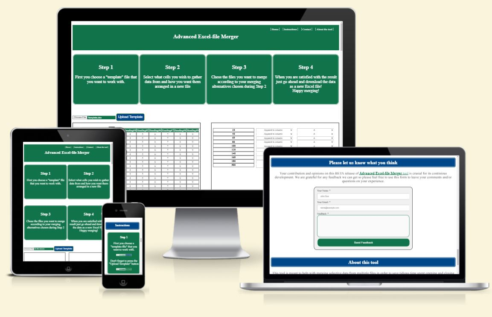

[Check out the tool here!](https://kristofergab.github.io/advanced-excel-file-merger/)

## CONTENTS
---
* [User Experience](#user-experience)
  * [Initial Discussion](#initial-discussion)
  * [User Stories](#user-stories)
* [Design](#design)
  * [Color Scheme](#color-scheme)
  * [Typography](#typography)
  * [Imagery](#imagery)
  * [Wireframes](#wireframes)
* [Features](#features)
  * [General Features](#general-features)
  * [Features Left To Implement](#features-left-to-implement)
  * [Accessibility](#accessibility)
* [Technologies Used](#technologies-used)
  * [Languages Used](#languages-used)
  * [Frameworks & Programs Used](#frameworks-&-programs-used)
* [Deployment](#deployment)
* [Testing](#testing)
  * [Validator Testing](#validator-testing)
  * [Known Bugs](#known-bugs)
  * [Unfixed Bugs](#unfixed-bugs)
  * [User Stories Testing](#user-stories-testing)
  * [Full Testing](#full-testing)
* [Credits](#credits)
  * [Content](#content)
  * [Media](#media)
---
---

## User Experience (UX)
---
### Initial Discussion
AEF Merger is a tool meant for companies in need of making analysis by collecting information from a large amount of files. We are talking about years of saving excel files where a template has been used and then saved as separate files in folders. This has for a long time been a common practice in companie departments like finance, sales, customer service, production and logistics.

### User Stories

#### Client Goals

- Create value by saving companies time with tedious collection of information stored in multiple files

#### First Time Visitor Goals

- I am in the need of collecting data from multiple excel-files and what a simple, quick and effective way of doing this.

#### Returning Visitor Goals

- I want to do more analysis and whant to use this tool again as last time.
- I want to do even more advanced merging alternatives than before.

## Design
---
### Color Scheme

The color scheme was chosen by using the eye dropper tool from Chrome dev-tools on the top bar on Microsoft excel. Simplistic color was decided to put more focus and emphasis on the tool at hand.

### Typography

Standard browser fonts are alowed in this project to focus time and effort on the tool.

### Imagery
All images was are taken from the site itself and no exteranl imagery was used in this project.

### Wireframes

Wireframes were created using the program Balsamiq for desktop use.

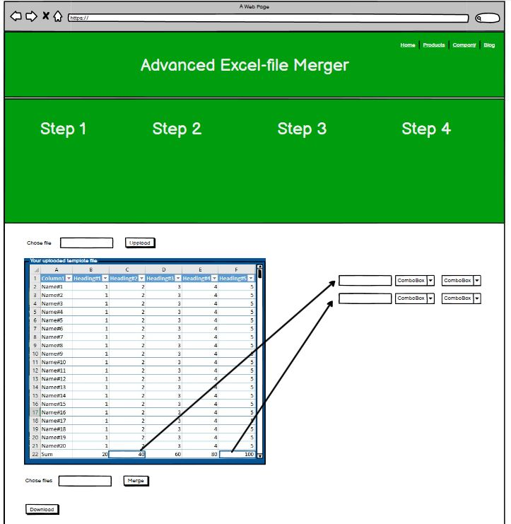

## Features 
---
Several features have been inqluded in this one-page website. These features will be categorized in separate titles to enhance its intended use and functions.

### General Features

- __Navigation Bar__

  - A simple navigation bar to locate the different sections on the website to quickly get to where needed. This is also included at the bottom of the site.

  

- __The landing page__

  - The landing page is meant to be simple and clear with all the steps needed to use the tool already visible for simplicity and effectivness.

  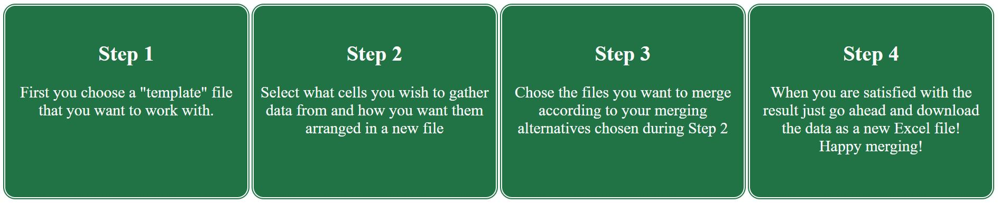

- __Merging tool Section__

  - This is the main part of the site and holds the powerful tool. Here you chose the template file and upload it to the site so that your merge options can be made. Here you also choose what files you want to merge and collect data from. You also have the possibility to unselect your choises incase the wrong cell was pressed.

- __Instructions Section__

  - This section explaines the steps for using the tool in more details with added images as support and also a video at the end of the section. The reason why this is below the tool is because of accessabillity to the tool part itself since it will most likely be a tool to come back to again and again.

  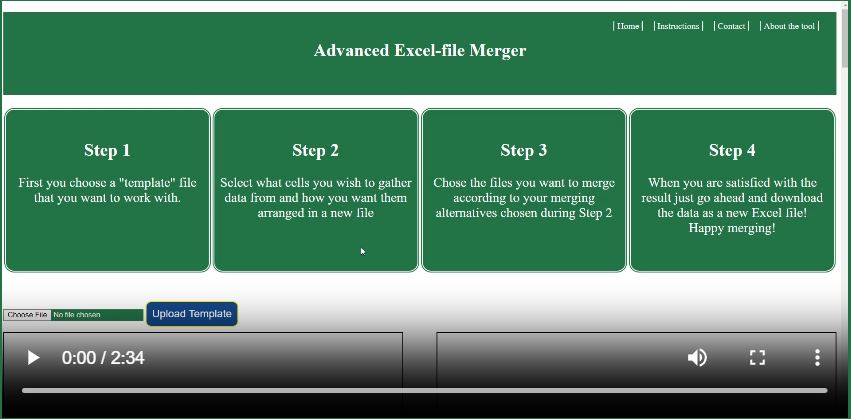

- __Contact section__

  - As this tool is still in it's early development stage with loads more options possible for the future, a contact form is created to make sure that feedback can be resieved as part of continous work.

  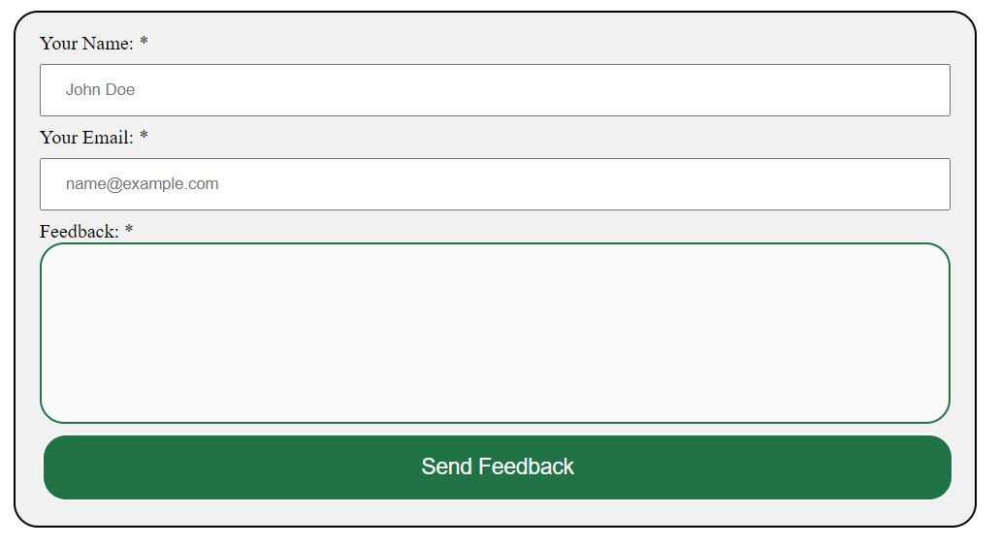

- __About this tool section__

  - This section is a short disclaimer clearifying that the use of this tool is limited at the moment. It also intend to show what more functionalities are intended for future use.

- __The Footer__ 

  - The footer section is more to end the page and let you reach the sections you want to go back to to quickly get started and back to merging!

### Features Left to Implement

- Decide what column or row to append the data as seen in the display window today.
- Making mathematical operations between cells as per user wishes.
- Include intelligens such as find the last value in a row or column instead of chosing a static cell.
- Overall design improvements on the site.

### Accessibility

During the development process the accessibility has been considered througout to ensure that it is user friendly for everyone. Constant checks has been made with the Chrome Dev tool Lighthouse to ensure this by:
- Using aria-labels for buttons.
- Using alternative descriptive attributes for all images used.
- Ensuring sufficient contrast throughout the color schemes.

## Technologies Used
---
### Languages Used

In this project JavaScript, HTML and CSS were used to create this site.

### Frameworks & Programs Used

Balsamiq - Used to create wireframe.

Git - For version control.

Github - To save and store the files for the website.

Google Dev Tools - To troubleshoot and test features, solve issues with responsiveness and styling.

Google Dev Tools Lighthouse - For performance, accessibility, Best Practices and SEO

Am I Responsive? - To show the website image on a range of devices.

SheetJS - Library for working with excel files.

## Deployment
---
- The site was deployed to GitHub pages. The steps to deploy are as follows: 
  1.  In the GitHub repository, navigate to the Settings tab 
  2.  From the source section drop-down menu, select the main Branch
  3.  Once the main branch has been selected, the page will be automatically refreshed with a detailed ribbon display to indicate the successful deployment. 

The live link can be found here - https://kristofergab.github.io/advanced-excel-file-merger/

## __Testing__ 
---
This website is built for Desktop viewing in mind and is therefor optimized for this purpose. Testing has been done during the developments different stages with lighthouse as a main resource to ensure the best performance possible at the same time as accessibility and best practices are followed and adhered to. Chrome dev-tools was the main source for designing the site where the Inspect window was constantly being observed to ensure the intended results. 
Worth mentioning is that the development of the JavaScript was the most time consuming part in this project and alot of testing was continously run to ensure its function. More information about this under Full Testing.

This is the final lighthouse test result for the deployed website:
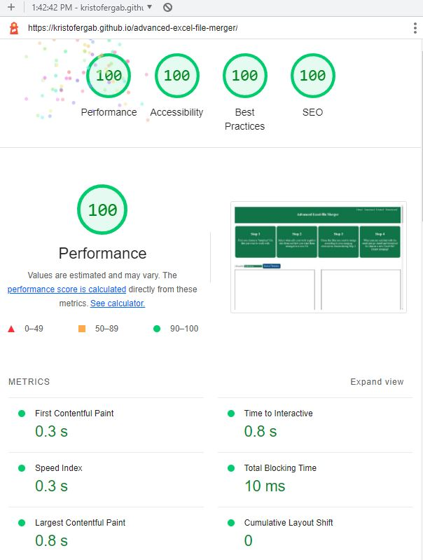

While desktop was the focus for the build, media queries have been added to make sure that it works on other devices as well, such as tablet and mobile. Since this tool is directed to companies and users intended to do advanced merging with alot of data this tool works on computers only at the moment. It is viewable on mobile devices but is not intended to be used there.

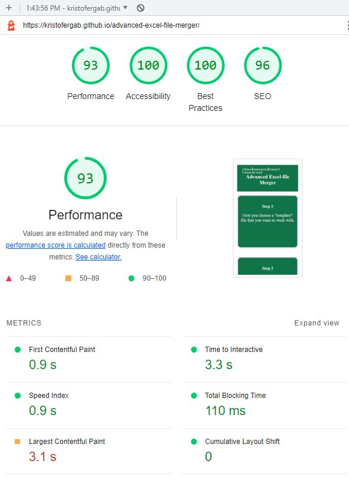

### Validator Testing 

This one page site has been run through the W3C validator for HTML and the Jigsaw validator for CSS.

- HTML
  - No errors were returned when passing through the official [W3C validator](https://validator.w3.org/nu/?doc=https%3A%2F%2Fkristofergab.github.io%2Fadvanced-excel-file-merger%2F)

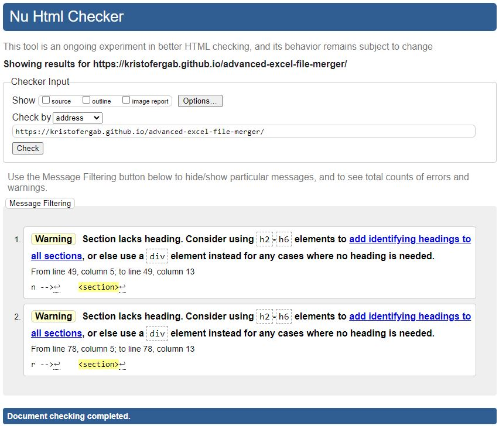

- CSS
  - No errors were found when passing through the official [W3C (Jigsaw) validator](https://jigsaw.w3.org/css-validator/validator?uri=https%3A%2F%2Fkristofergab.github.io%2Fadvanced-excel-file-merger%2F&profile=css3svg&usermedium=all&warning=1&vextwarning=&lang=en)

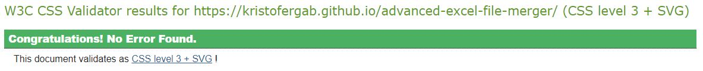

### Known Bugs

- On mobile devices the verificaiton on fileformats is not working as intended which means that wrong formats can be loaded causing unpredicted behaviour.

### Unfixed Bugs

- Mobile fileformat verification.

### User Stories Testing

- __First Time Visitors__
  - *I am in the need of collecting data from multiple excel-files and what a simple, quick and effective way of doing this.*
  - When landing on this page a quick 4 step instruction is given with the tool right there at the bottom of the screen, already visible and ready to be used.
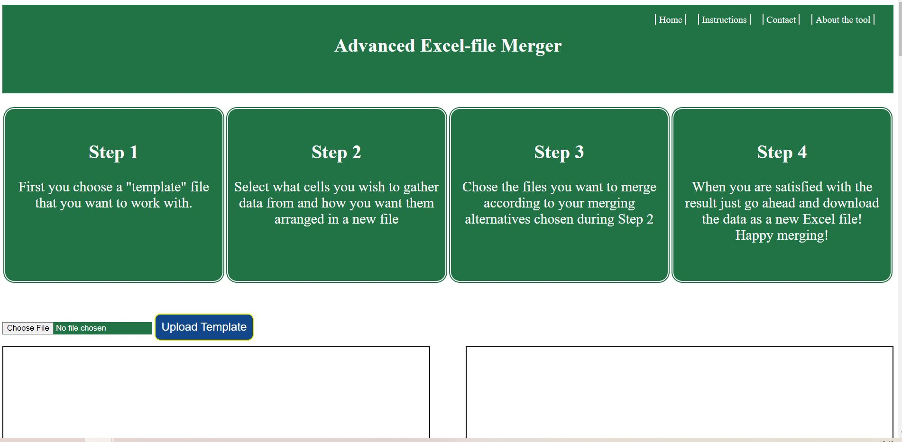
  - Following the 4 step method you can quickly access the tools potential by upploading your template file. After a few clicks it is easy to see that you can select the cells you want or remove what you did not intend do pick.
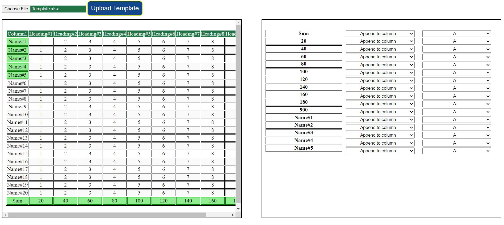
  - If more information is needed there is a more indepth explanation on the steps including an instruction video to help the user along
  - When the cell selections are made it's easy to choose what files to implement this collection/merge on and then easily download the result:

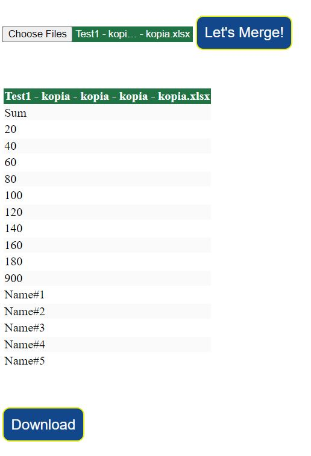

- __Returning Visitors__
  - *I want to do more analysis and whant to use this tool again as last time.* Se steps under first time visitors. Built with easy access to the tool right at the top for returning visitors also in mind.

  - *I want to do even more advanced merging alternatives than before.* Many functionalities are possible to add over time to this tool but is today restricted to simply appending all selected cells to the A column. This will have to evolve over time since this projects timeline does not allow for further builds in order to move forward in the course.

### Full Testing

The website has been test on multiple devices with different screen sizes and resolutions, using multiple different browser to ensure functionality and to find any potential bugs.

Devices tested on:
- Desktop Display hp 24" screen
- Large laptop with 20" screen
- Huawei P20 Pro
- iPad Air 2

Browsers tested on:
- Chrome
- Edge
- Firefox

Functionality tests:
- All links have been tested for internal linking within the site and verified so that it takes the user to the correct section. All links work as expected.
- The form has been checked so that it is not possible to submit without filling in the required fields - Name and email. The email input checks and makes sure that it is a valid address. The feedback also requires to be filld with some text according to the user wishes.

- This tool is able to handle a large amount of data and files in very little time. Tests has been made with various filesizes and quantities with very promising results. 
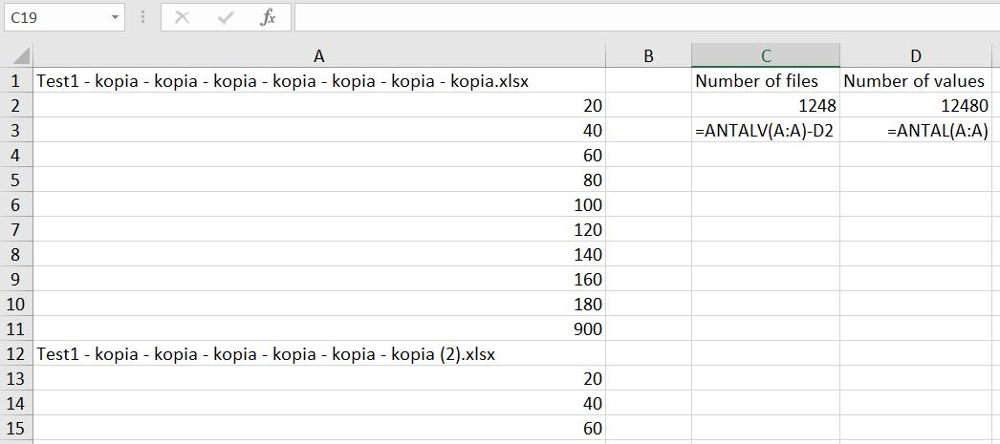
- In this test we used over one thousand files and gathered data from over ten thousend cells - all done in under a second. 
- This being said it is important to gather user feedback in order to get better understanding of problems that might arise. Such problems might involve very "heavy" or large files being used - this is not yet tested.

## Credits 
---

### Content 

In this section all the webpages that were used as help for the development of this site will be listed. First the link to the website will be presented and then the information what the site was used for explained right after the link.

https://www.w3schools.com/tags/att_input_list.asp
for list in HTML

https://docs.sheetjs.com/docs/getting-started/installation/standalone
https://code-boxx.com/javascript-excel-html-table/
https://www.webslesson.info/2021/07/how-to-display-excel-data-in-html-table.html
https://web.dev/read-files/#read-content
js
import excelfile using sheetsjs

https://stackoverflow.com/questions/5990725/how-to-delay-execution-in-between-the-following-in-my-javascript
for delaying running code

https://www.w3schools.com/jsref/tryit.asp?filename=tryjsref_table_cells
https://www.w3schools.com/jsref/coll_table_cells.asp
for getting cells in rows for eventlistener

https://www.w3schools.com/jsref/met_element_remove.asp
for removing html elements

https://stackoverflow.com/questions/21659888/find-and-remove-objects-in-an-array-based-on-a-key-value-in-javascript
for finding and removing objects in an array vased on a key value

https://stackoverflow.com/questions/62259233/javascript-get-table-cell-content-on-click
for querySelector to add eventlistener on all tabledata

https://www.w3schools.com/jsref/jsref_tostring_string.asp
for .toString method

https://stackoverflow.com/questions/24925336/set-html5-input-list-value-with-javascript
for input datalist in javascript

https://stackoverflow.com/questions/17001961/how-to-add-drop-down-list-select-programmatically
for select list option using for loop for alphabet array

https://www.w3schools.com/html/tryit.asp?filename=tryhtml_form_mail
for submitting form

https://stackoverflow.com/questions/9537838/div-height-100-and-expands-to-fit-content
for overflow auto

https://web.dev/lazy-loading-video/
for preloading none (lazyloading)

https://stackoverflow.com/questions/1438722/thank-you-alert-upon-form-submission
for onsubmit alert on form

### Media

- No external media used in the project so far

-Credit to Wondershare DemoCreator that made the video on youtube on how to screenrecord using powerpoint!
https://www.youtube.com/watch?v=3I8IzHa2rY4
for recording desktop using powerpoint. Time 1:33